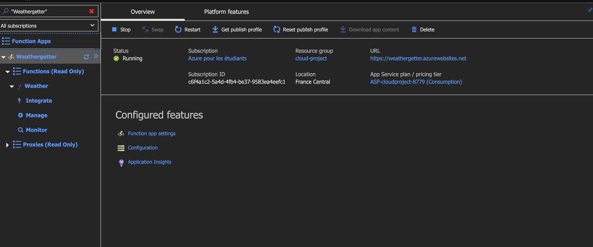
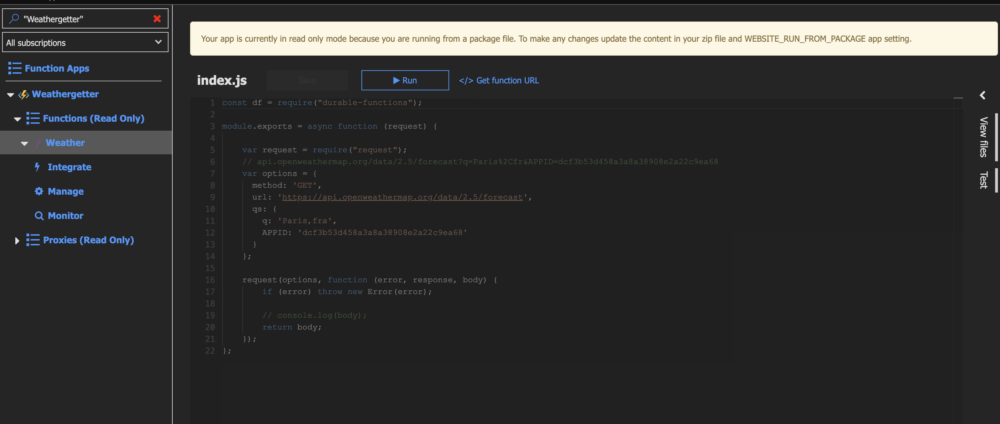
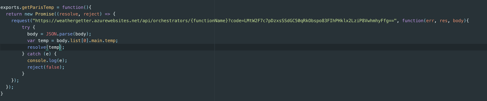

# azure-terraform-script

Ce script terraform permet de créer des resources nécessaires pour avoir l'architecture demander par le _client_.


## Deploiement

`cd azure-terraform/`

`./script.sh TENANT_ID SUB_ID CLIENT_ID CLIENT_SECRET APP_GIT`


## Serverless function ([wut...](https://www.memecreator.org/static/images/memes/5005887.jpg))

Pour cette partie, nous avons utilisé Azure Functions:





## API

Dans l'API nous avons utilisé NODE JS.

La requete suivante nous permet d'appeller la _serverless function_:



Pour ensuite sauvegarder:


## Registry

`az acr login -n myregistry`

Il faut ensuite obtenir le server name du registry `az acr list`

Tag l'image en local:
```bash
docker tag myimage:local myregistry.azurecr.io/myimage:v1
```

Ensuite il faut push l'image:

```bash
docker push myregistry.azurecr.io/myimage:v1
```

Il faut ensuite dans le `Dockerfile` de l'image du front indiquer dans `FROM` le ecr d'Azure pour qu'il utilise cette image.
